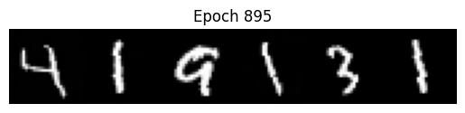

# minidiff

Recently got back to DDPMs and had to brush up on my basics. Inspired by Karpathy Sensei's [nanochat](https://github.com/karpathy/nanochat), I thought it would be fun to try a minimal implementation of the classic [Ho et al. paper](https://proceedings.neurips.cc/paper/2020/hash/4c5bcfec8584af0d967f1ab10179ca4b-Abstract.html).

In this work, I train a DDPM to unconditionally generate MNIST samples.

## Setup
Dependency management is via [uv](https://docs.astral.sh/uv/):

`uv sync` 
